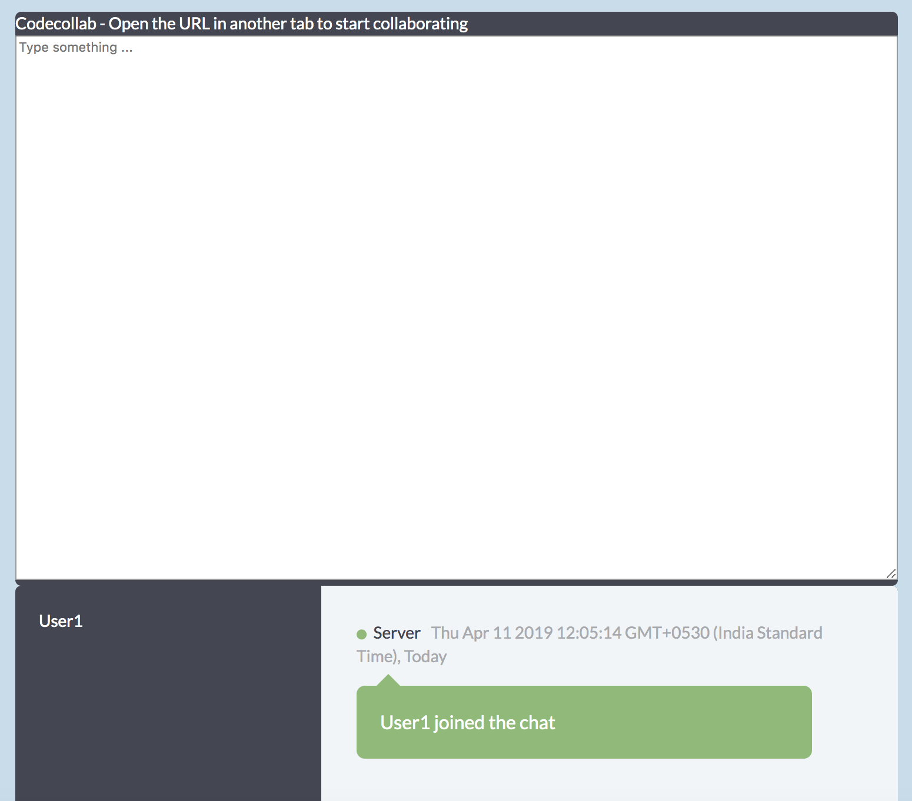
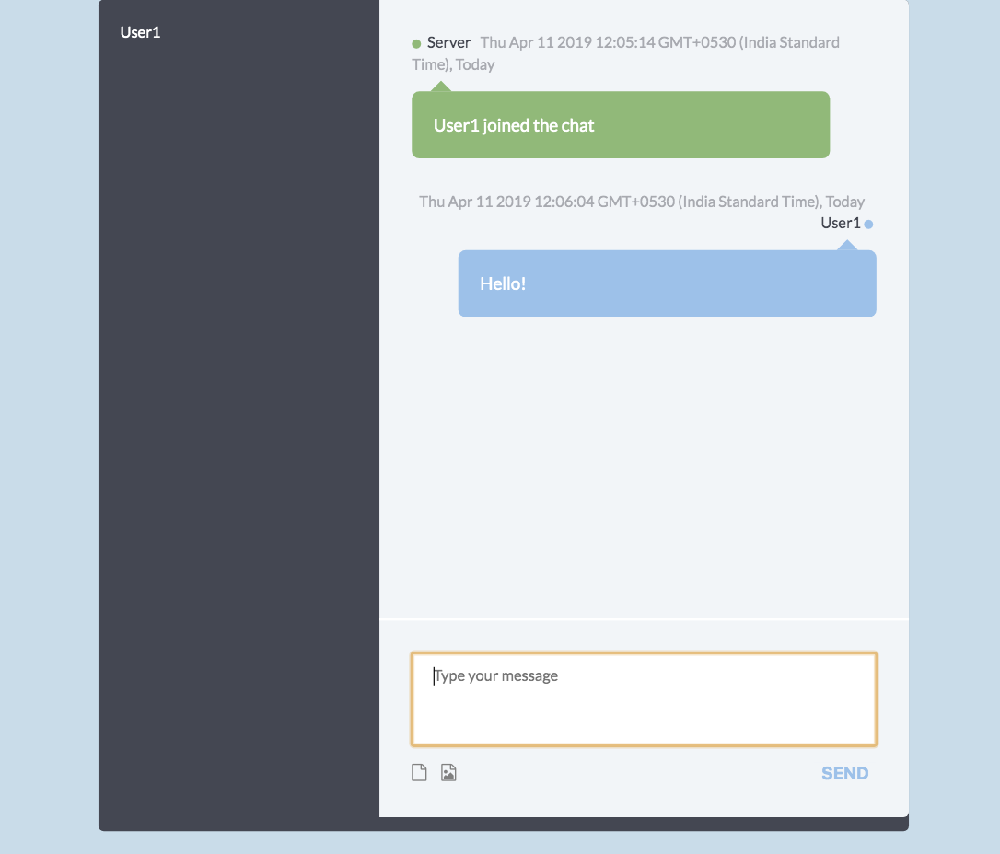
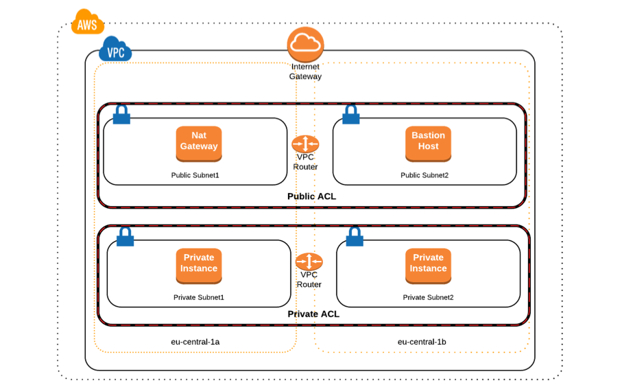
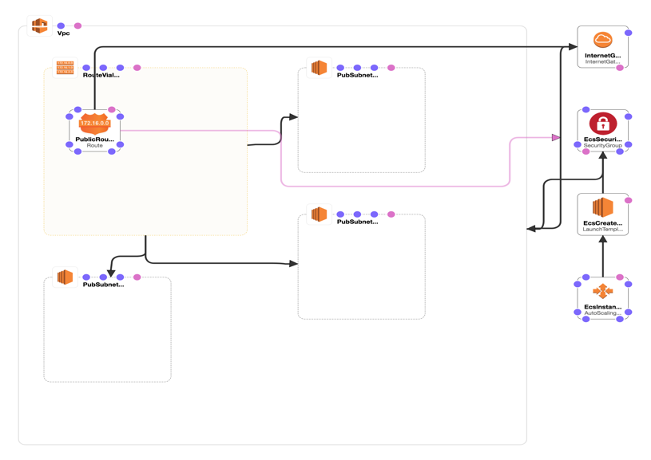

# codecollab - is a Collaborative Text Workspace with Chat Support.

Built with [javalin.io](https://javalin.io/) - which is a lightweight Java & Kotlin framework which provides a simple abstracted implementation of WebSockets used for this webapp.

## live at http://codecollab-1591334708.ap-south-1.elb.amazonaws.com/

## screenshot

## run locally
* `git clone https://github.com/arniesaha.git`
* `cd codecollab`
* `mvn install`
* `java -jar target/codecollab-jar-with-dependencies.jar`

## run locally with docker

* `git clone https://github.com/arniesaha/codecollab.git`
* `cd codecollab`
* `docker build -t codecallab .`
* `docker run -it --rm --name codecollab -p 7070:7070 codecollab`
* browse to http://localhost:7070

## deployment strategy: Amazon Elastic Container Service with Docker

## vpc architecture:

A private VPC is created for the application services. Access to the deployed instances via ECS is through a private accessible via the Bastion Host.

## security strategy:

[ecs-cluster-vpc-part1](https://medium.com/@ahmetatalay/building-highly-available-scalable-and-reliable-ecs-clusters-part-1-creating-vpc-1321640225cc)

[ecs-cluster-vpc-part2](https://medium.com/@ahmetatalay/building-highly-available-scalable-and-reliable-ecs-clusters-part-2-deploying-microservices-5eb4816b84b)

## webapp architecture via cloudformation

This is deployed under a ECS cluster of type Networking + EC2 (Under above VPC) with 1 (t2.micro) containers and 1 task under service with AutoScale policy of CPU Utilisation higher than 80% to scale upto 4 tasks.

## goals of the project:

* To showcase full-stack skills of building a web application using a Java framework
* Front-end implementation via html, css & javascript
* Deployment strategy via docker and aws

## To-dos

* Implementing a code editor like [codemirror](https://codemirror.net/) for the collaborative section for use-cases like collaborative online interview calls.
* Implement authentication and login/logout states.
* Implement persistance either via saving session on drive or traditional DBs like MongoDB or Redis
