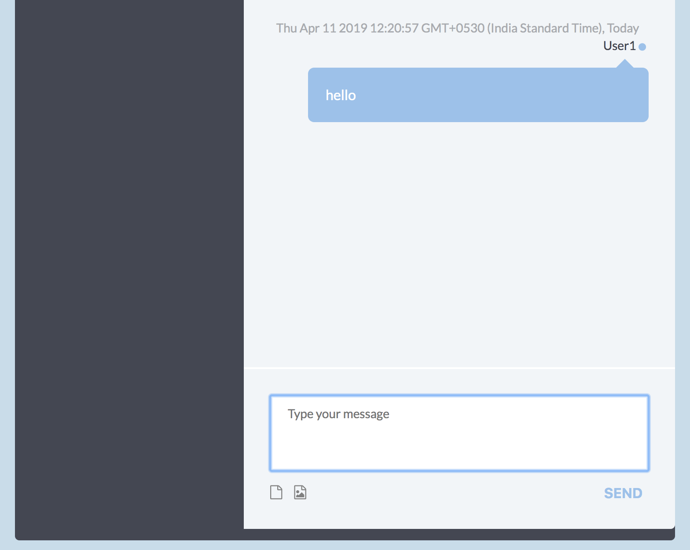

# codecollab

## live at http://codecollab-1591334708.ap-south-1.elb.amazonaws.com/

## screenshot

## run locally
* `git clone https://github.com/arniesaha.git`
* `cd codecollab`
* `mvn install`
* `java -jar target/codecollab-jar-with-dependencies.jar`

## run locally with docker

* `git clone https://github.com/arniesaha/codecollab.git`
* `cd codecollab`
* `docker build -t codecallab .`
* `docker run -it --rm --name codecollab -p 7070:7070 codecollab`
* browse to http://localhost:7070
